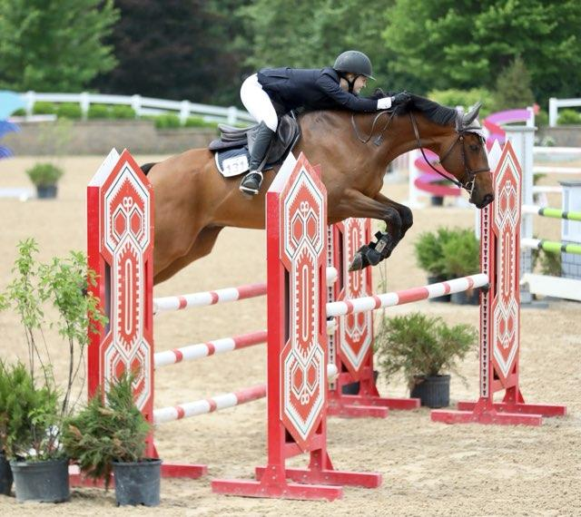

# Equestrian

I started riding horses when I was 8 years old. I started competing when I was 10 and got my first horse at 13. I competed in the jumper discipline which is not judged but timed to determine a winner. It was the biggest thing in my life besides school up until I went to college. Unfortunately, we had to sell my horse in my 2nd year of college for financial reasons. I hope to get back to it some day as I miss it every day.

Me in a competition with my horse Schotze.