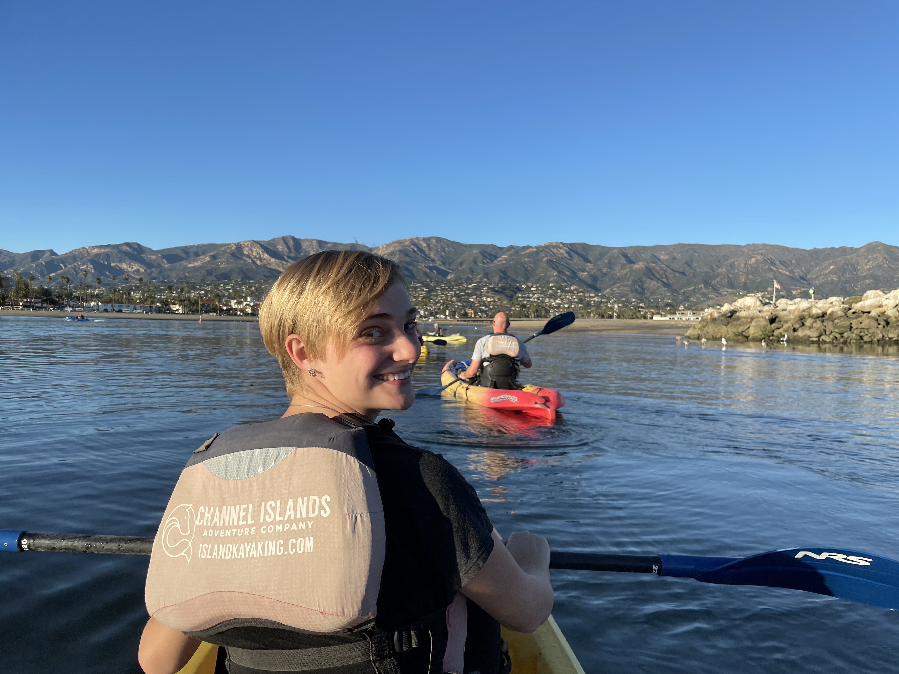

# Kayaking Journeys

My first time kayaking was in the ocean in Maine during a vacation with family. While it wasn't exactly a simple start, I have loved it ever since. 

Since then, every chance I got, I would go kayaking. Unfortunately, until I lived at UCSB, I did not live near a body of water to kayak on, nor did I own one. So I would kayak with my family during vacations and once on the Chicago river (which was dirty and in a 2 person kayak, my mom behind me did not appreciate the splashing). Once at UCSB, there were kayaks available from the school that I used. My now husband bought a kayak in my second year at UCSB that we used on lakes and the ocean. We are hoping to find a place to kayak in Montreal!

 
Me kayaking in the Santa Barbara Channel