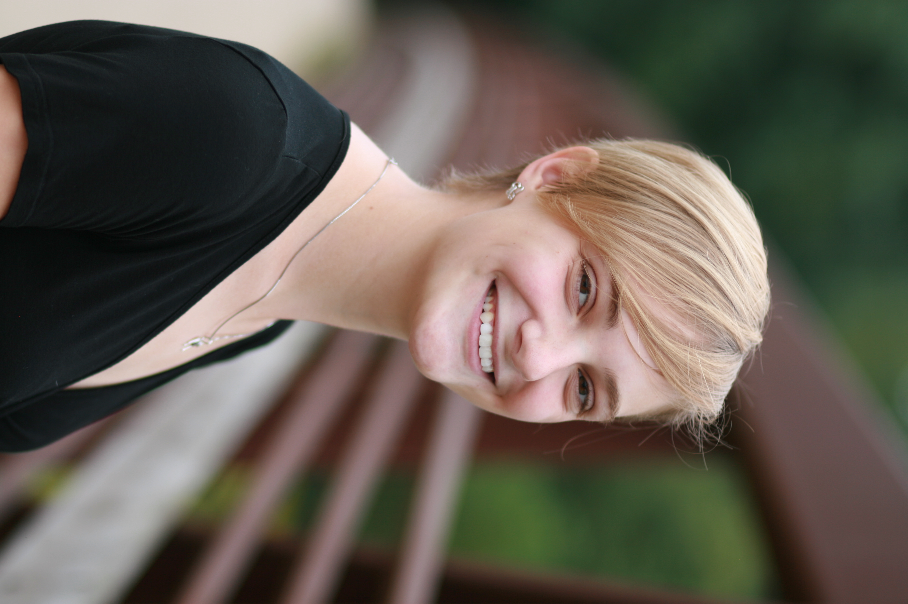

# Welcome to My Research Page

{align="left": style="height:150;width:150px"}
Welcome to my digital platform. I am an astrophysics graduate student in the process of continuing my pursuit of finding out as much as possible about the universe. I am currently working on my master's as part of the [Astroflash](https://astroflash-frb.github.io/) and the [CHIME](https://chime-experiment.ca/en) collaborations in radio astronomy and fast radio bursts at McGill University. I welcome contact for questions or collaboration at my email: rdarlinger@gmail.com. 

If you're like to learn more about me, you can find an introduction to [my research](./reasearch/index.md), some info on some [outreach](./outreach/index.md) and some more info [about me](./about/index.md).